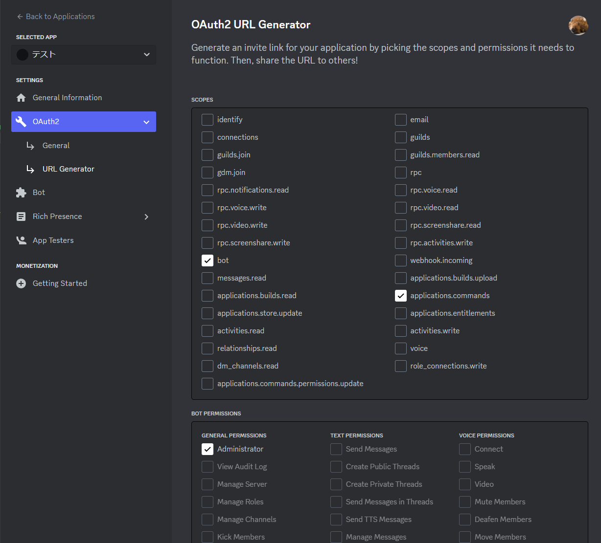
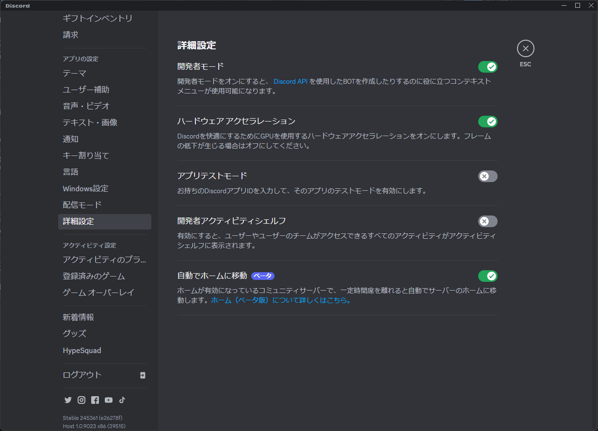
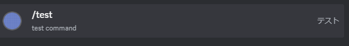
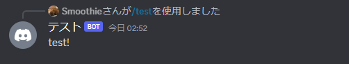

<h2 class="sticky_note">
動作環境
</h2>

- Python 3.11.3
- discord.py 2.3.2

<h2 class="sticky_note">
Botの初期設定
</h2>


Discord DeveloperからのBotの作成はいずれ解説します。  

Botの作成方法を理解している人はOAuth2 URL Generatorにて画像のように設定してください。  
また、`BOT PERMISSIONS`についてはテストBotのため管理者をつけていますが、<span class="highlighter_yellow">使用用途に合わせた必要な権限のみにしてください。</span>  

ファイル構成
```
Bot
├── DiscordKeys
│   ├── token.txt
│   └── guild_id.txt
└── bot.py
```

<h2 class="sticky_note">
DiscordKeysフォルダーについて
</h2>
DiscordのBotにはトークンを発行する必要があります。  
トークンはBot作成時に <span class="highlighter_yellow">__一度__</span> だけ表示されます。  
トークンが他人に知られると、その<span class="highlighter_red">Botを悪用される可能性があります。</span>   
事故防止のためにトークンは別ファイルに保存しています。 
Gitで管理する場合フォルダーを.gitignoreに追加してください。  

<h2 class="sticky_note">
guild_id.txtについて
</h2>

guild_idはサーバーのIDです。
スラッシュコマンドはギルドコマンドとグローバルコマンドの2種類があり、ギルドコマンドは
サーバー内でのみ使用できるかわりに反映が早いらしい **要出典**

取得方法は画像の場所にある、開発者モードをオンの状態にしてからサーバーの右クリックからサーバーIDをコピーでできます。


<h2 class="sticky_note">
DiscordBotのテンプレート
</h2>

```python:title=bot.py
import os

import discord
from discord import app_commands

#Discord Bot Initialize
client = discord.Client(intents=discord.Intents.default())
tree = discord.app_commands.CommandTree(client)

DiscordIDs = 'DiscordKeys/'

with open(os.path.join(DiscordIDs, 'token.txt'), 'r') as t, \
     open(os.path.join(DiscordIDs, "guild_id.txt"), 'r') as g:
    
    TOKEN = t.read()
    GUILD_ID = g.read()

guild=discord.Object(GUILD_ID)

@tree.command(
    guild=guild,
    name='test',
    description='test command'
)
async def test(ctx:discord.Integration):
    await ctx.response.send_message("test!")

@client.event
async def on_ready():
    print('ready...')
    await tree.sync(guild=guild)
    print('synced...')

client.run(TOKEN)
```

## コード解説

```python
client = discord.Client(intents=discord.Intents.default())
tree = discord.app_commands.CommandTree(client)
 ```
よく言われるおまじないです。  
client部分はインテントといってスラッシュコマンドが実装される前は`!test`だったり`/test`だったりと、  
コマンドを認識させる文字列をintentsを使って設定してました。（確か）  

treeはスラッシュコマンドを使うために必要なものです。

```python{4}
@client.event
async def on_ready():
    print('ready...')
    await tree.sync(guild=guild)
    print('synced...')

client.run(TOKEN)
```

`await tree.sync(guild=guild)`にてスラッシュコマンドを同期させています。


```python
@tree.command(
    guild=guild,
    name='test',
    description='test command'
)
async def test(ctx:discord.Integration):
    await ctx.response.send_message("test!")
```

Discordのコマンドのテンプレートです。  
コマンドを追加する場合これを元に作成します。  
`guild=guild`はスラッシュコマンドを使用するサーバーを指定しています。  
`name='test'`はコマンド名です。小文字のみ使用可能です。  
`description='test command'`はコマンドの説明です。

## 実行結果



今後もDiscord Botで便利な機能を紹介できればいいなと思っています。