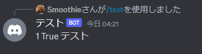

<h2 class="sticky_note">
動作環境
</h2>

- Python 3.11.3
- discord.py 2.3.2

<h2 class="sticky_note">
コマンドオプションとは
</h2>

<a href="/blogs/2023-11-15-DiscordBotInit" class="link" title="DiscordBotのテンプレート記事リンク" >DisocrdBotのテンプレート</a>
では`/test`というコマンドを作成しました。  
このコマンドは`/test`で使用できBotが`test!`と返すというものでした。  
ただ、コマンドを作成する上で何かユーザーに選択肢を与えたいときがあります。

たとえば、じゃんけんBotを作りたいときに、`/janken`というコマンドを作成し、Botが手を返すだけではゲームとして成り立ちません。  
じゃんけんである以上ユーザーが何を出すかの選択が欲しいですよね？  

このようなときに使用するのが<span class="highlighter_yellow">コマンドオプション</span>です。

<h2 class="sticky_note">
コマンドオプションの作成
</h2>

せっかくなのでじゃんけんBotを作成してみましょう！と言いたいところですが、  
まずは<span class="highlighter_yellow">簡単なコマンドオプション</span>を作成してみましょう。

```python{24,25}:title=bot.py
import os

import discord
from discord import app_commands

#Discord Bot Initialize
client = discord.Client(intents=discord.Intents.default())
tree = discord.app_commands.CommandTree(client)

DiscordIDs = 'DiscordKeys/'

with open(os.path.join(DiscordIDs, 'token.txt'), 'r') as t,      open(os.path.join(DiscordIDs, "guild_id.txt"), 'r') as g:
    
    TOKEN = t.read()
    GUILD_ID = g.read()

guild=discord.Object(GUILD_ID)

@tree.command(
    guild=guild,
    name='test',
    description='test'
)
async def test(ctx:discord.Integration,boolean:bool,name:discord.User,number:int=999):
    await ctx.response.send_message(f"{number} {boolean} {name}")

@client.event
async def on_ready():
    print('ready...')
    await tree.sync(guild=guild)
    print('synced...')

client.run(TOKEN)

```
コードの中身のほとんどは前回と同じです。  
注目点はハイライトしている部分です。  

`ctx:discord.Integration`はコマンドを実行したユーザーだったりコマンドに関する情報が入っています。  
この後ろにコマンドオプションを設定できます。  
今回は`boolean:bool`と`name:discord.User`と`number:int=999`を設定しています。

<h3 class="sticky_note">
実行結果
</h3>




ユーザー名の後ろに`テスト#数字`と数字がついて表示されますが、画像中では隠しています。


オプションの設定は`変数名:型=デフォルト値`という形で設定できます。  
デフォルト値は省略可能です。（実行例では1を入力しています。）

ここで<span class="highlighter_red">コマンドオプションを使用する上での注意点</span>を説明します。

1. オプションに使用できる変数は<span class="highlighter_yellow">__小文字のみ__</span>です。
2. デフォルト値は省略可能です。省略された場合、<span class="highlighter_yellow">__必須オプション__</span>となります。  
3. デフォルト値が設定されている場合、他のオプションとなり<span class="highlighter_yellow">__省略可能__</span>になります。  
4. 必須オプションの場合、コマンドを実行する際に<span class="highlighter_yellow">__必要なオプション__</span>となります。
5. デフォルト値を設定する際には<span class="highlighter_red">__オプションの順番を最後に設定する必要があります。__</span>
6. デフォルト値に`None`を設定することで初期値を設定せず、<span class="highlighter_yellow">__他のオプション__</span>にできます。（変数には`None`が当然入ります。）

<h3 class="sticky_note">エラー例</h3>
コマンドオプションが未入力の場合のエラー表示  


```python{1}:title=注意点5のエラー例
async def test(ctx:discord.Integration,number:int=999,boolean:bool,name:discord.User):
```

コマンドオプションで指定できる型はさまざまで挙げきれないので、割愛します。  
基本的には以下の型が使用できると知っていればBot作りには困らないと思います。

* int
* float
* bool
* str
* Literal

Literalは少し特殊で、  
`from typing import Literal`をインポートする必要があります。  
また、Literalでは以下のように選択肢を設定できます。  
`your_choice:Literal["グー","チョキ","パー"]`  
このように設定することで、`グー`、`チョキ`、`パー`の3つの選択肢を設定できます。  
注意として、選択肢の<span class="highlighter_red">最大数は25個</span>です。

また、今回例で使用した`discord.User`はユーザーのIDを取得するためのものです。
他にもdiscord特有の使用できる型があります。

<a href="https://discordpy.readthedocs.io/ja/latest/ext/commands/commands.html#discord-converters" target=”_blank” class="link" title="Discord.pyのリファレンス" >Disocrd.pyのリファレンス</a>

上記のリファレンスを参考にすると幅広いBot作りができると思います。

また、オプションで作成した変数はコマンド内で使用できます。  
今回の例ではそのまま出力していますが、変数を使用して処理を行うこともできます。  


<h2 class="sticky_note">
じゃんけんBotの作成
</h2>

オプションの機能を理解したところで肝心のじゃんけんBotを作成していきましょう。  
といっても今回学んだオプションとじゃんけん部分の処理があるだけなので、  
いきなりコードを貼り付けます。


```python:title=bot.py
import os
import random
from typing import Literal

import discord
from discord import app_commands

#Discord Bot Initialize
client = discord.Client(intents=discord.Intents.default())
tree = discord.app_commands.CommandTree(client)

DiscordIDs = 'DiscordKeys/'

with open(os.path.join(DiscordIDs, 'token.txt'), 'r') as t,      open(os.path.join(DiscordIDs, "guild_id.txt"), 'r') as g:
    
    TOKEN = t.read()
    GUILD_ID = g.read()

guild=discord.Object(GUILD_ID)

@tree.command(
    guild=guild,
    name='janken',
    description='じゃんけんゲーム'
)
@discord.app_commands.describe(
    your_choice="あなたの手",
)
async def greet(ctx:discord.Integration,your_choice:Literal["グー","チョキ","パー"]):
    cpu_choice=random.choice(["グー","チョキ","パー"])
    if cpu_choice==your_choice:
        await ctx.response.send_message(f"CPUの手は{cpu_choice}、あなたの手は{your_choice}\n結果:あいこ")
    else:
        if (your_choice=="グー" and cpu_choice=="チョキ") or (your_choice=="チョキ" and cpu_choice=="パー") or (your_choice=="パー" and cpu_choice=="グー"):
            await ctx.response.send_message(f"CPUの手は{cpu_choice}、あなたの手は{your_choice}\n結果:あなたの勝ち")
        else:
            await ctx.response.send_message(f"CPUの手は{cpu_choice}、あなたの手は{your_choice}\n結果:あなたの負け")

@client.event
async def on_ready():
    print('ready...')
    await tree.sync(guild=guild)
    print('synced...')

client.run(TOKEN)

```

じゃんけんBotの処理部分のみ切り抜きます。

```python
@tree.command(
    guild=guild,
    name='janken',
    description='じゃんけんゲーム'
)
@discord.app_commands.describe(
    your_choice="あなたの手",
)
async def greet(ctx:discord.Integration,your_choice:Literal["グー","チョキ","パー"]):
    cpu_choice=random.choice(["グー","チョキ","パー"])
    if cpu_choice==your_choice:
        await ctx.response.send_message(f"CPUの手は{cpu_choice}、あなたの手は{your_choice}\n結果:あいこ")
    else:
        if (your_choice=="グー" and cpu_choice=="チョキ") or (your_choice=="チョキ" and cpu_choice=="パー") or (your_choice=="パー" and cpu_choice=="グー"):
            await ctx.response.send_message(f"CPUの手は{cpu_choice}、あなたの手は{your_choice}\n結果:あなたの勝ち")
        else:
            await ctx.response.send_message(f"CPUの手は{cpu_choice}、あなたの手は{your_choice}\n結果:あなたの負け")
```

ただじゃんけんBotを作成しても面白くないので、  
新たにオプションの説明追加しました。  
そちらの説明もします。

```python
@discord.app_commands.describe(
    your_choice="あなたの手",
)
```

<h3 class="sticky_note">
実行結果
</h3>


オプションで指定した変数名に対して説明を設定できます。  
これを設定することでオプションの選択肢部分に説明が追加されます。  
今回の場合は`あなたの手`が選択肢に追加されます。

<span class="highlighter_yellow">Botを使用するユーザー目線で使いやすいBotを目指すには覚えておいて損はないです。</span>


実際に選択肢を選択してコマンドを実行すると、じゃんけんを実行しその結果を返します。

<h2 class="sticky_note">
まとめ
</h2>

今回はコマンドオプションの基本的な使い方を説明しました。  
コマンドオプションはBotを作成する上で必須の知識です。  

途中でLiteralを使いオプションの選択肢を設定する方法を説明しましたが、  
<span class="highlighter_yellow">オートコンプリート機能を使い、strの型で似たようなことができます。</span>  
こちらもLiteral同様選択肢を25個まで設定が可能で、  
違いとしては<span class="highlighter_yellow">Literalは指定した選択肢のみ使用できる</span>のに対し、  
こちらはあくまで型はstrなので<span class="highlighter_red">選択肢以外の入力</span>も受け付けます。

こちらの機能についてはまた別の記事で紹介できればと思います。

今回説明した内容をまとめると以下のようになります。

1. オプション機能の記載方法  
    `async def test(ctx:discord.Integration,option:str):`  
2. オプションの設定は`変数名:型=デフォルト値`という形で設定でき、<span class="highlighter_red">デフォルト値は省略可能です。</span>  
3. オプションの種類は<span class="highlighter_red">必須オプションと他のオプション</span>に分かれます。  
4. 必須オプションはデフォルト値を設定されてない場合に<span class="highlighter_red">自動で設定されコマンド実行時に必要</span>になります。  
5. オプションの値はコマンド中で使用可能です。

これらの知識があれば、スロットBotや今回作成したじゃんけんBotのような応用次第で様々なBotを作成できると思います。  

では、良きDiscordBotライフを！