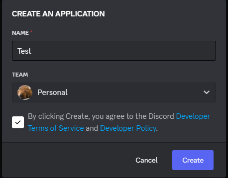
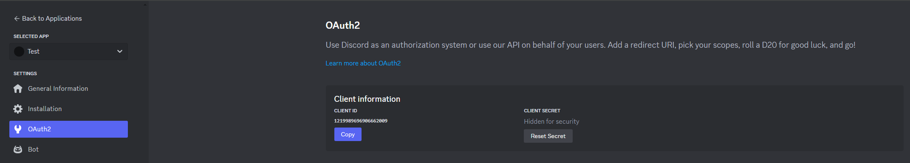
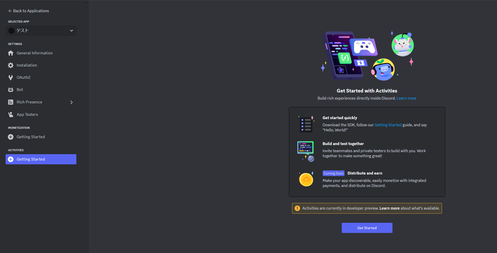
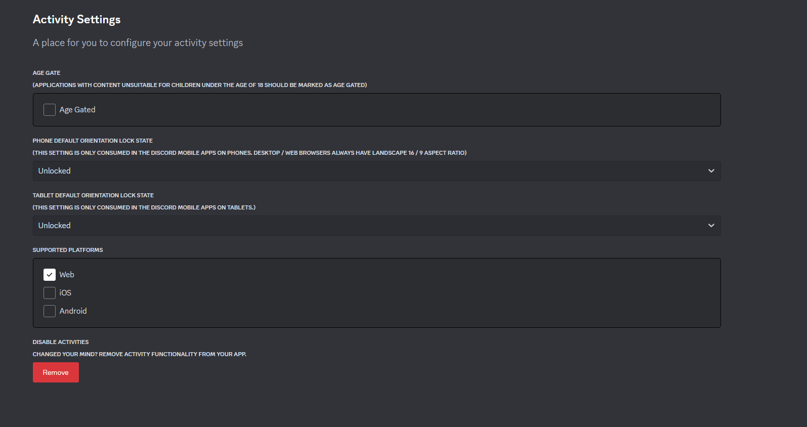
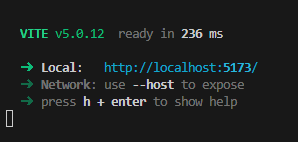
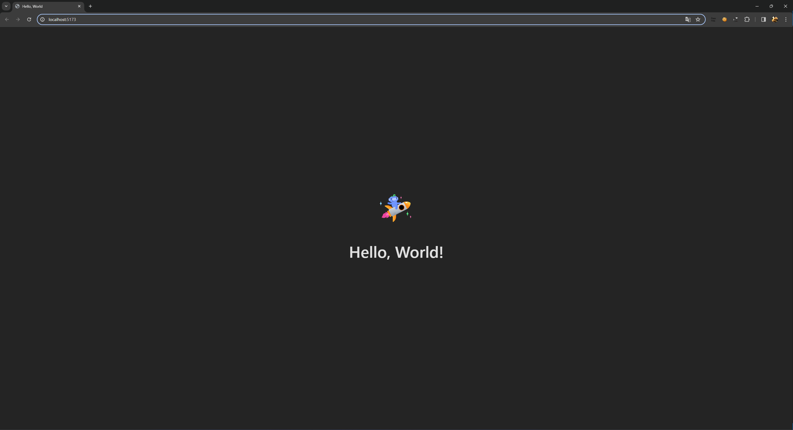
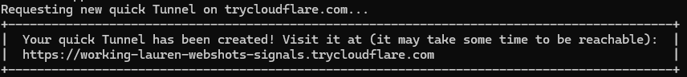
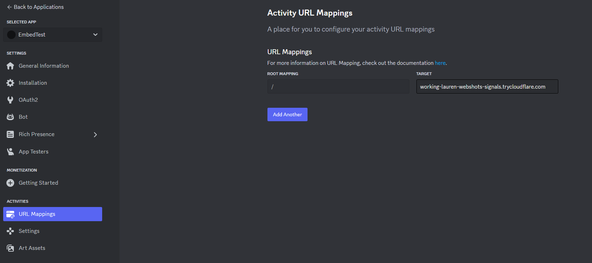
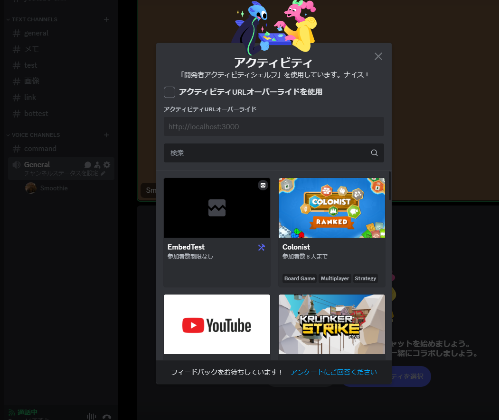
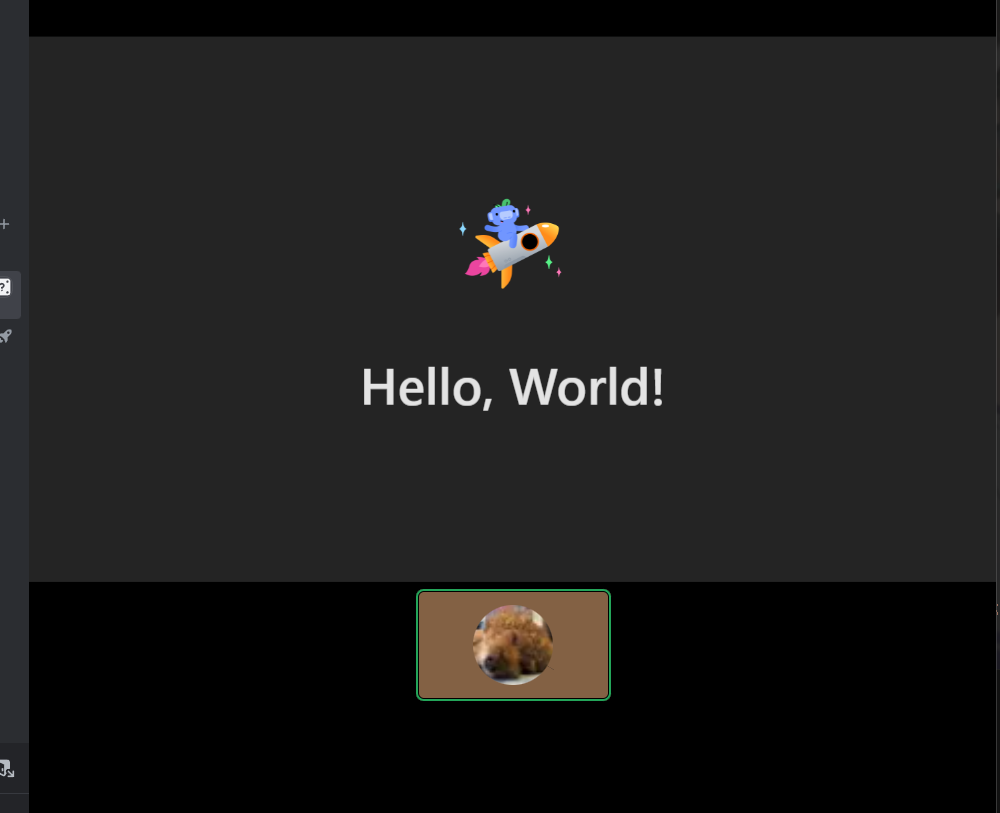

<h2 class="sticky_note">
動作環境
</h2>

- Node v20.11.1
- Windows 11
- Git

<h2 class="sticky_note">
とりあえず公式のHello,worldデモを動かすまで
</h2>

<h2 class="sticky_note">

1. 諸々環境作成に必要なものをインストール
</h2>

### Node.jsインストール
<a href="https://nodejs.org/en" class="link">Node.jsダウンロード先</a>

### embedded app SDKインストール

```Shell:title=PowerShell
npm install @discord/embedded-app-sdk
```

### cloudflaredインストール

<a href="https://developers.cloudflare.com/cloudflare-one/connections/connect-networks/downloads/#windows" class="link">参考</a>

```Shell:title=cloudflared
winget install --id Cloudflare.cloudflared
```
<h2 class="sticky_note">

2. Discord側の設定
</h2>

New Applicationから新規アプリを作成する。



OAuth2からCLIENT IDを控える


<span class="highlighter_yellow">__CLIENT ID__</span> と <span class="highlighter_yellow">__CLIENT SECRET__</span> の両方が必要なので注意



ACTIVITIESよりGetting Startをクリックする。


ここからアクティビティの画面の向きや対象プラットフォームを指定できる。


<h2 class="sticky_note">

3. サンプルコードの実行
</h2>

サンプルコードをGitからクローンする。

```Shell:title=Git
git clone https://github.com/discord/getting-started-activity.git
```
`getting-started-activity/example.env`
このファイルを`.env`にリネームする。
CLIENT IDなどを入力する。

```Shell:title=.env
VITE_DISCORD_CLIENT_ID=CLIENT IDをここに入力
DISCORD_CLIENT_SECRET=CLIENT SECRETをここに入力
```
`getting-started-activity/client/`
フォルダから`npm install`→`npm run dev`を実行。


表示されているURLを押すとブラウザ上で実行結果が見れる。


Discordで表示するにはもう一つ作業が必要となる。
別途PowerShellにて
```Shell:title=PowerShell
cloudflared tunnel --url http://localhost:5173
```
URLは先程の`npm run dev`で実行されたときに表示されたURLを指定する。

四角で囲まれたところにURLが記載されているのでこれを控える。


DiscordのデベロッパーポータルサイトのURL MappingsにURLを登録する。


### 最終確認

- [x] クローンしたサンプルコードのClientから実行している。
- [x] cloudflaredを実行し生成されたURLをポータルサイトに登録している。

以上の二点を満たせてる状態になっていれば実行できるはずです。

Discordの通話に参加しアクティビティを選択する画面を開くと自分のアクティビティが存在するはずです。



それを選択すると以下のようにサンプルが実行され表示されます。



ついにアクティビティを自分で作れるようになったのでBot制作以外にもやれることが増えて最高です。  
Webつよつよ人間は本領発揮できそうなのでこれからが楽しみですね。