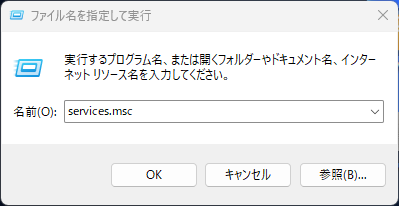
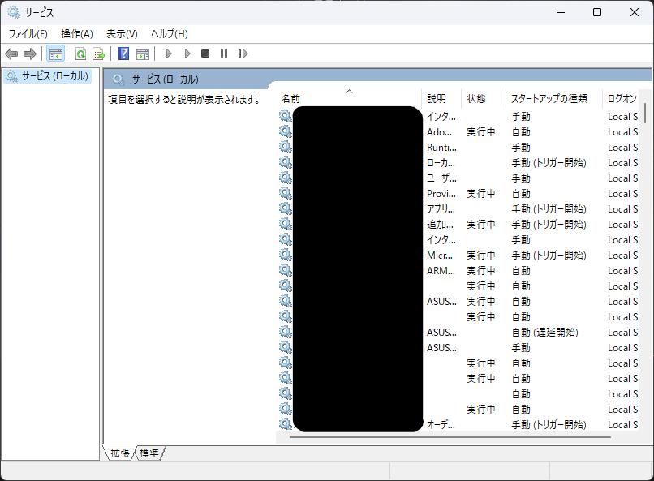
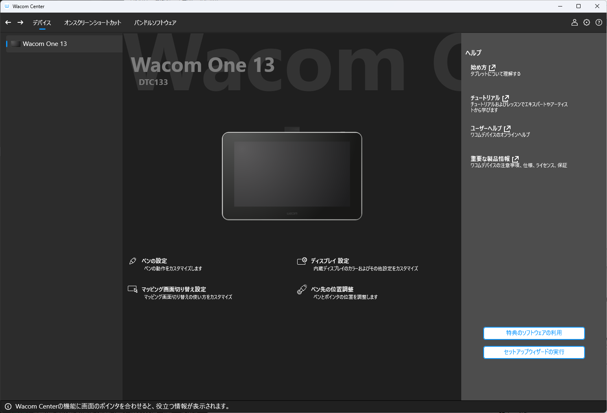

Wacomタブレットのアップデート後通常再起動を求められ、再起動するまで正常に動作しません。  
再起動はめんどくさいので、再起動せずに使い続ける方法を紹介します。  
__自己責任__ でお願いします。  

# 手順
## 1. サービスを開く

`Windowsキー+R`で表示されるファイル名を指定して実行ウィンドウに`service.msc`を入力しOKを押す

## 2. Wacom Professional Serviceを開始する
サービスウィンドウから`Wacom Professional Service`を探す

右クリックから開始をクリックする

Wacom Centerが表示されれば __成功__ です。

このような形でサービスを開始することで再起動せずに使用し続けられますが、  
特に途中の作業がない場合などは素直に再起動したほうが良いと思います。